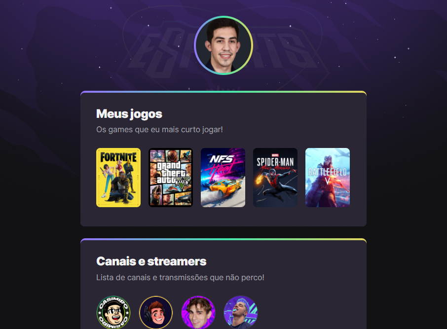

# 🚀 NLW eSports 🎮

> Trilha Explorer

Projeto construído no evento Next Level Week da Rocketseat.

## 🎯 Objetivo

O objetivo foi desenvolver o Game hub, um site centralizador de links, no estilo Linktree, feito especialmente para gamers utilizarem na Twitch e outras redes sociais com a proposta de compartilhar quais games e canais acompanham.

[🔗 Clique aqui para acessar](https://luiseduardot17.github.io/nlw-esports-explorer/)

## 🔨 Tecnologias

- HTML
- CSS
- Git e Github

## 📲 Contato

- Meu E-mail: luis_eduardogdeo@hotmail.com
- [Meu Linkedin](https://www.linkedin.com/in/luiseduardogdeoliveira) 
